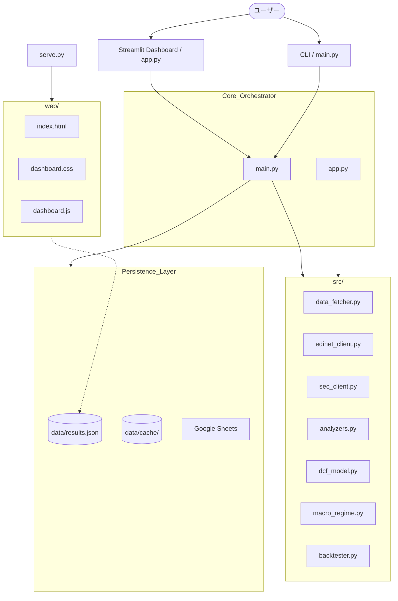

# 🤖 AI投資司令塔 - CIO Prototype システム設計書

本ドキュメントは、AIを活用した株式分析システム「CIO Prototype」の設計、仕様、および実装ロードマップをまとめたものです。

---

## 変更履歴

| バージョン | 変更内容 | ステータス |
| :--- | :--- | :--- |
| **v1.0** | 初版：4軸スコアリング、DCFモデル、バックテスト基本機能 | ✅ 完了 |
| **v1.1** | 取引コスト反映、短期戦略の日次ループ化、データキャッシュ実装 | ✅ 完了 |
| **v1.2** | ATRベース動的エグジット、拡張マクロ判定、AIエンジン管理、統計的検証、ポジションサイジング | 🔵 進行中 |

---

## 1. システム概要
銘柄コードを入力するだけで、財務データ、テクニカル指標、マクロ環境、および定性情報（有報/10-K）を統合的に解析し、プロフェッショナルな投資レポートと4軸スコアカードを自動生成します。

### 主要な目標
- **市場のバグの発見**: 数値と定性情報を照合し、市場が見落としている価値を特定。
- **CIOレベルの意思決定補助**: 統合的な評価に基づくBUY/WATCH/SELLシグナルの提示。
- **分析の自動化**: yfinance、EDINET/SEC、Gemini/Groqを連携させた自動パイプライン。

---

## 2. システムアーキテクチャ

---

## 3. コンポーネント詳細

### 3.1 4軸スコアリングエンジン (`analyzers.py`)
定量的・定性的なデータを4つのレイヤーで評価します（0.0〜10.0点）。

- **Layer 1: Fundamental (企業の地力)**: ROE、営業利益率、CF品質等を評価。
- **Layer 2: Valuation (投資の割安度)**: PER、PBR、DCF理論株価との乖離を評価。
- **Layer 3: Technical (タイミング)**: RSI、MA乖離、ボリンジャーバンド等を評価。
- **Layer 4: Qualitative (定性分析)**: AIによる有報/10-Kの深掘り解析。

### 3.2 マクロ環境判定 (`macro_regime.py`) ★v1.2拡張
VIX、金利に加え、イールドカーブや信用スプレッドを監視します。
- **YIELD_INVERSION (逆イールド)**: 景気後退シグナルとして、Fundamentalの重みを45%に引き上げ。
- **CREDIT_STRESS (信用収縮)**: HYGの変動を監視し、RISK_OFF判定を強化。

### 3.3 バックテストモジュール (`src/backtester.py`) ★v1.1/v1.2更新
過去データに基づき戦略の有効性を検証します。
- **解像度の最適化**: 大まかな長期戦略（月次）と、精密な短期戦略（日次）を自動切り替え。
- **取引コスト**: 往復コスト（execution_cost_bps）を考慮。
- **エグジット戦略**:
    - **Long**: シグナルベースまたはATRトレーリングストップ。
    - **Short**: **ATRベース動的損切り(1.5x) / 利確(2.5x)**（✅ 実装済み）。
- **統計的検証**: ウォークフォワード検証、モンテカルロシミュレーション（🔲 未実装）。

### 3.4 AIエンジン管理 (`data_fetcher.py`) ★v1.2更新
- **Reproducibility**: 使用モデル名（Gemini 2.0 Flash / Pro 等）をレポートに記録。
- **Fallback**: GeminiからGroq(Llama3)への自動切り替えと、JSONスキーマの強制適用。

---

## 4. 残件（未実施の内容）

| 項目 | 優先度 | 内容 |
| :--- | :--- | :--- |
| **拡張マクロ判定の実装** | 🟡 B | 逆イールドやHYGの監視ロジックのコード反映 |
| **バックテスト統計検証** | 🔴 S | ウォークフォワード分離、モンテカルロ試行の実装 |
| **ポジションサイジング** | 🟠 A | ポートフォリオ全体での最大露出度や銘柄数制限 |
| **DCF成長率の自動連携** | 🟡 B | 有報のAI解析結果をDCFの成長シナリオへ自動反映 |
| **UIの高度化** | 🔵 C | バックテスト結果のグラフ表示強化、資産推移の可視化 |

---

## 5. データ連携とセキュリティ
- **.gitignore**: APIキー、キャッシュ、一時ログはGitHubへアップロードされないよう徹底。
- **Cache**: `data/cache` フォルダにてAPIレスポンスを管理。

---
> [!IMPORTANT]
> 本設計書は v1.2 への移行期にあります。✅マークは実装完了、🔲マークは次フェーズの実装対象です。
