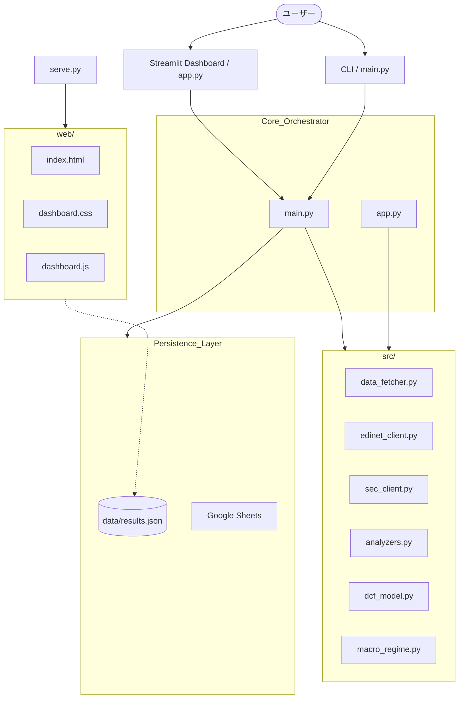

# 🤖 AI投資司令塔 - CIO Prototype システム設計書

本ドキュメントは、AIを活用した株式分析システム「CIO Prototype」の現状の設計と仕様をまとめたものです。

## 1. システム概要
銘柄コード（日本株・米国株）を入力するだけで、財務データ、テクニカル指標、マクロ環境、および有価証券報告書（有報/10-K）を統合的に解析し、プロフェッショナルな投資レポートと4軸スコアカードを自動生成するシステムです。

### 主要な目標
- **市場のバグの発見**: 財務数値と定性情報をAIで照合し、市場が見落としている本質的価値を特定する。
- **CIOレベルの意思決定補助**: 複数の判断指標を統合し、BUY/WATCH/SELLのシグナルを提示する。
- **分析の自動化**: yfinance、EDINET、SEC、Gemini/Groqを連携させた自動パイプライン。

---

## 2. システムアーキテクチャ

---

## 3. コンポーネント詳細

### 3.1 オーケストレーター (`main.py`)
システムの司令塔として、以下のフローを制御します：
1. 分析対象銘柄の基本データ取得。
2. マクロ環境の判定。
3. 比較対象銘柄（競合）の自動選定とデータ取得。
4. 定性データ（有報/10-K）の取得と解析。
5. DCF法による理論株価の算出。
6. 4軸スコアカードの生成。
7. AIによる総合投資レポートの生成。
8. 結果の保存と通知。

### 3.2 4軸スコアリングエンジン (`analyzers.py`)
定量的・定性的なデータを4つのレイヤーで評価します（0.0〜10.0点）。

| 軸 (Layer) | 評価内容 | 主な指標 |
| :--- | :--- | :--- |
| **Fundamental** | 企業の地力 | ROE, 営業利益率, 自己資本比率, CF品質, R&D比率 |
| **Valuation** | 投資の割安度 | PER, PBR, 配当利回り, 目標乖離, DCF乖離 |
| **Technical** | タイミング | RSI, MA乖離率, BB位置, ボラティリティ, 出来高 |
| **Qualitative** | 将来の期待値 | 有報リスク, 堀(Moat), R&D戦略, 経営陣トーン |

> [!TIP]
> **セクター別補正**: セクター（Technology, Financial等）に応じて、評価基準（閾値）と各軸の重みを自動調整します。

### 3.3 マクロ環境判定 (`macro_regime.py`)
VIX指数、米10年債利回り、ドル円、原油価格から現在の相場環境（Regime）を特定します。
- `RISK_ON`, `RISK_OFF`, `RATE_HIKE`, `RATE_CUT`, `NEUTRAL`
- 環境に応じて、スコアカードの重みを動的に変更（例：金利上昇時はグロース株のValuation重みをアップ）。

### 3.4 DCF理論株価モデル (`dcf_model.py`)
フリーキャッシュフロー（FCF）の履歴に基づき、将来の成長シナリオを予測して理論株価を算出します。
- 3つのシナリオ（Bull / Base / Bear）を提示。
- 安全域（Margin of Safety）と上昇余地を可視化。

### 3.5 AIエンジン (`data_fetcher.py`)
Gemini API (3.0 Flash/Pro) を主力とし、レート制限時には Groq (Llama 3) へ自動フォールバックする堅牢な実装です。

---

## 4. UI/UX

### 4.1 Streamlit Dashboard (`app.py`)
- **インタラクティブ分析**: ブラウザ上で銘柄を入力し、リアルタイムで分析を実行。
- **モジュール構成**: `src/` 配下のパッケージ化されたモジュールを利用し、保守性を向上。
- **履歴閲覧**: 過去の分析結果をサイドバーから即座に呼び出し。

### 4.2 Web Intelligence Dashboard (`web/index.html`)
- **リソース分離**: HTML/JS/CSS を `web/` ディレクトリに分離し、開発の見通しを改善。
- **静的配信**: `serve.py` を通じて `web/` フォルダを起点とした配信を実施。

---

## 5. データ連携と拡張性

- **Google Sheets**: 分析結果をスプレッドシートに自動書き出しし、ポートフォリオ管理に活用。
- **LINE**: 通知機能により、移動中でも重要な分析結果を確認可能。
- **Config**: `config.json` により、スコアリングの閾値やセクター定義をコード変更なしでデ正可能。

---

## 6. 今後の課題・ロードマップ
- **バックテスト機能**: 推奨シグナル（BUY）のその後のパフォーマンス測定。
- **マルチモーダル解析**: 決算説明会資料の画像やグラフの解析。
- **ポートフォリオ最適化**: 複数銘柄の相関を考慮した適正配分の提示。

---
> [!NOTE]
> 本設計書は現時点の実装に基づいています。適宜アップデートが必要です。
