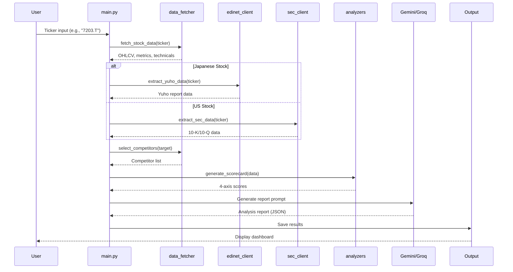

# 🏗️ CIO Intelligence System Design

## 1. システム概要

### 1.1 目的
外資との「対戦表」を自動生成し、市場が気づいていない本質的価値のバグを発見する AI 投資分析システム。

### 1.2 アーキテクチャ概要
```
┌─────────────────────────────────────────────────────────────┐
│                    CIO Intelligence System                   │
├─────────────────────────────────────────────────────────────┤
│  ┌─────────────┐  ┌──────────────┐  ┌──────────────┐       │
│  │ Data Layer  │  │ Analysis     │  │ Output       │       │
│  │             │  │ Layer        │  │ Layer        │       │
│  │ - yfinance  │  │ - Scoring    │  │ - Dashboard  │       │
│  │ - EDINET    │  │ - AI Report  │  │ - Sheets     │       │
│  │ - SEC       │  │ - Strategy   │  │ - Notion     │       │
│  │ - Macro     │  │ - Backtest   │  │ - LINE       │       │
│  └─────────────┘  └──────────────┘  └──────────────┘       │
└─────────────────────────────────────────────────────────────┘
```

---

## 2. システム構成図

### 2.1 全体アーキテクチャ

```
                    ┌──────────────────┐
                    │   User Input     │
                    │  (Ticker Code)   │
                    └────────┬─────────┘
                             │
                             ▼
┌────────────────────────────────────────────────────────────┐
│                    main.py (Orchestrator)                   │
│  - Workflow control                                         │
│  - Error handling & retries                                 │
│  - Result aggregation                                       │
└─────────────┬──────────────────────────────────────────────┘
              │
    ┌─────────┼─────────┬─────────────┬──────────────┐
    │         │         │             │              │
    ▼         ▼         ▼             ▼              ▼
┌────────┐ ┌────────┐ ┌────────┐ ┌────────┐  ┌──────────┐
│ data_  │ │ edinet │ │  sec   │ │ macro  │  │ dcf_     │
│ fetcher│ │client  │ │ client │ │regime  │  │ model    │
└───┬────┘ └───┬────┘ └───┬────┘ └───┬────┘  └────┬─────┘
    │         │         │         │               │
    │         ▼         ▼         │               │
    │    ┌─────────────────┐      │               │
    │    │   Yuho/10-K     │      │               │
    │    │   Parser        │      │               │
    │    └────────┬────────┘      │               │
    │             │               │               │
    ▼             ▼               ▼               ▼
┌──────────────────────────────────────────────────────────┐
│                  analyzers.py (Scoring Engine)            │
│  - Fundamental Score (0-10)                               │
│  - Valuation Score (0-10)                                 │
│  - Technical Score (0-10)                                 │
│  - Qualitative Score (0-10)                               │
│  - Sector-specific thresholds                             │
└──────────────────────────────────────────────────────────┘
              │
              ▼
┌──────────────────────────────────────────────────────────┐
│              strategies.py (Strategy Logic)               │
│  - Long Strategy                                          │
│  - Bounce Strategy                                        │
│  - Breakout Strategy                                      │
│  - Regime-based adjustments                               │
└──────────────────────────────────────────────────────────┘
              │
              ▼
┌──────────────────────────────────────────────────────────┐
│                 AI Report Generation                      │
│  - Gemini API (Primary)                                   │
│  - Groq API (Fallback)                                    │
│  - Competitor analysis                                    │
│  - Investment recommendation                              │
└──────────────────────────────────────────────────────────┘
              │
              ▼
┌──────────────────────────────────────────────────────────┐
│                    Output Layer                           │
│  - app.py (Streamlit Dashboard)                           │
│  - Google Sheets                                          │
│  - Notion                                                 │
│  - LINE Notification                                      │
│  - Markdown Report                                        │
└──────────────────────────────────────────────────────────┘
```

---

## 3. データフロー

### 3.1 分析実行フロー



### 3.2 スコア計算フロー

```
┌─────────────────────────────────────────────────────────────┐
│                    Scorecard Generation                      │
├─────────────────────────────────────────────────────────────┤
│                                                              │
│  Fundamental (地力)                                          │
│  ├─ ROE (Return on Equity)                                  │
│  ├─ Operating Margin (営業利益率)                            │
│  └─ Equity Ratio (自己資本比率)                             │
│                                                              │
│  Valuation (割安度)                                          │
│  ├─ PER (Price to Earnings)                                 │
│  ├─ PBR (Price to Book)                                     │
│  └─ Dividend Yield (配当利回り)                             │
│                                                              │
│  Technical (タイミング)                                       │
│  ├─ RSI (Relative Strength Index)                           │
│  ├─ MA Deviation (移動平均乖離率)                            │
│  ├─ Bollinger Bands Position                                │
│  └─ Volatility (ボラティリティ)                              │
│                                                              │
│  Qualitative (定性)                                          │
│  ├─ EDINET/SEC Risk Analysis                                │
│  ├─ Moat (競争優位性)                                        │
│  ├─ R&D Investment                                          │
│  └─ Management Tone (経営陣トーン)                           │
│                                                              │
└─────────────────────────────────────────────────────────────┘
```

---

## 4. コンポーネント詳細

### 4.1 Data Layer

#### 4.1.1 `src/data_fetcher.py`
**役割**: yfinance による株価・財務データ取得

**主要関数**:
- `fetch_stock_data(ticker)`: 銘柄データの取得
- `select_competitors(target_data)`: 比較対象の自動選定
- `call_gemini(prompt, parse_json)`: Gemini API 呼び出し

**取得データ**:
```python
{
    "metrics": {
        "market_cap": float,
        "pe_ratio": float,
        "pb_ratio": float,
        "roe": float,
        "operating_margin": float,
        "debt_to_equity": float,
        "dividend_yield": float,
        "revenue_growth": float,
        "earnings_growth": float
    },
    "technical": {
        "rsi": float,
        "ma25_deviation": float,
        "ma75_deviation": float,
        "bb_position": float,
        "volatility": float,
        "current_price": float
    },
    "history": DataFrame  # 株価ヒストリカルデータ
}
```

#### 4.1.2 `src/edinet_client.py`
**役割**: EDINET API v2 による有価証券報告書取得

**主要関数**:
- `extract_yuho_data(ticker)`: 有報データの抽出
- `is_japanese_stock(ticker)`: 日本株判定
- `format_yuho_for_prompt(yuho_data)`: プロンプト用フォーマット

**抽出項目**:
- 事業等のリスク
- 経営方針・環境
- 研究開発活動
- 経営陣トーン分析

#### 4.1.3 `src/sec_client.py`
**役割**: SEC EDGAR による 10-K/10-Q 取得

**主要関数**:
- `extract_sec_data(ticker)`: SEC ファイリング抽出
- `is_us_stock(ticker)`: 米国株判定

#### 4.1.4 `src/macro_regime.py`
**役割**: マクロ環境レジーム判定

**レジーム種類**:
- `RISK_ON`: リスク選好
- `RISK_OFF`: リスク回避
- `RATE_HIKE`: 利上げ環境
- `RATE_CUT`: 利下げ環境
- `YIELD_INVERSION`: 利回り逆転
- `NEUTRAL`: 中立
- `BOJ_HIKE`: 日銀利上げ
- `YEN_WEAK`: 円安
- `YEN_STRONG`: 円高
- `NIKKEI_BULL`: 日経上昇

**監視指標**:
- VIX 指数
- 米国 10 年利回り (^TNX)
- 米国 2 年利回り (^IRX)
- ドル指数 (DXY)
- 原油価格 (CL=F)
- HY 社債スプレッド (HYG)
- ドル円 (JPY=X)
- 日経平均 (^N225)

#### 4.1.5 `src/dcf_model.py`
**役割**: DCF による理論株価算出

**出力**:
```python
{
    "available": bool,
    "fair_value": float,
    "current_price": float,
    "upside": float,  # %
    "margin_of_safety": float,  # %
    "scenarios": {
        "bull": {"growth_rate": float, "fair_value": float},
        "base": {"growth_rate": float, "fair_value": float},
        "bear": {"growth_rate": float, "fair_value": float}
    }
}
```

---

### 4.2 Analysis Layer

#### 4.2.1 `src/analyzers.py`
**役割**: 4 軸スコアリングエンジン

**スコア計算ロジック**:

| 軸 | スコア範囲 | 主要指標 | セクター調整 |
|----|-----------|----------|-------------|
| Fundamental | 0-10 | ROE, 営業利益率，自己資本比率 | High-Growth: ROE 閾値 12% |
| Valuation | 0-10 | PER, PBR, 配当利回り | Value: PER 閾値 12x |
| Technical | 0-10 | RSI, MA 乖離，BB 位置 | - |
| Qualitative | 0-10 | リスク，Moat, R&D, 経営陣 | Tech: R&D 加重 1.5x |

**セクタープロファイル**:
```json
{
  "high_growth": {
    "sectors": ["Technology", "Communication Services"],
    "weights": {"fundamental": 0.20, "valuation": 0.25, "technical": 0.25, "qualitative": 0.30}
  },
  "value": {
    "sectors": ["Industrials", "Consumer Defensive", "Utilities"],
    "weights": {"fundamental": 0.35, "valuation": 0.30, "technical": 0.20, "qualitative": 0.15}
  },
  "financial": {
    "sectors": ["Financial Services"],
    "weights": {"fundamental": 0.35, "valuation": 0.30, "technical": 0.20, "qualitative": 0.15}
  }
}
```

#### 4.2.2 `src/strategies.py`
**役割**: 投資戦略ロジック

**戦略種類**:

1. **Long Strategy** (長期投資)
   - 基本条件：総合スコア >= 6.5
   - ファンダメンタルズ >= 5.0
   - レジームによる閾値調整

2. **Bounce Strategy** (短期リバウンド)
   - エントリー条件:
     - RSI(9) < 35
     - 価格がボリンジャーバンド下限に接触
     - 出来高 1.1 倍以上
   - 利食い：+5%
   - 損切り：-2.5%

3. **Breakout Strategy** (ブレイクアウト)
   - エントリー条件:
     - 価格が 75 日移動平均以上
     - ゴールデンクロス (5 日以内)
     - 20 日高値ブレイク
     - 出来高 1.2 倍以上
   - 利食い：+10%
   - 損切り：-3%

---

### 4.3 Output Layer

#### 4.3.1 `app.py` (Streamlit Dashboard)
**役割**: ブラウザベース分析ダッシュボード

**機能**:
- 銘柄入力・分析実行
- 4 軸スコア表示
- DCF 理論株価表示
- マクロレジーム表示
- 分析履歴
- バックテスト結果表示

#### 4.3.2 `src/sheets_writer.py`
**役割**: Google Sheets 出力

**出力先**:
- スプレッドシート ID: `config.json` で設定
- シート名：「分析結果」

#### 4.3.3 `src/notion_writer.py`
**役割**: Notion データベース出力

#### 4.3.4 `src/md_writer.py`
**役割**: Markdown レポート出力

#### 4.3.5 `src/notifier.py`
**役割**: LINE 通知

**機能**:
- LINE Messaging API によるプッシュ通知
- 分析結果通知
- 通知テスト機能

---

## 5. AI エンジン

### 5.1 構成

```
┌─────────────────────────────────────────────┐
│              AI Engine Layer                 │
├─────────────────────────────────────────────┤
│  Primary: Gemini 2.0 Flash                  │
│  - Model: gemini-2.0-flash                  │
│  - Temperature: 0.2                         │
│  - Max tokens: 8192                         │
│  - Max retries: 3                           │
├─────────────────────────────────────────────┤
│  Fallback: Groq (Llama 3)                   │
│  - Model: llama-3.3-70b-versatile          │
│  - Same parameters as Gemini               │
└─────────────────────────────────────────────┘
```

### 5.2 API 呼び出しフロー

```
1. Gemini API 呼び出し (プライマリ)
   ↓ (失敗時)
2. リトライ (最大 3 回)
   ↓ (全リトライ失敗)
3. Groq API にフォールバック
   ↓ (失敗時)
4. エラーハンドリング・ログ出力
```

### 5.3 プロンプト構造

```
┌─────────────────────────────────────────────────────────────┐
│                    AI Analysis Prompt                        │
├─────────────────────────────────────────────────────────────┤
│  System: あなたは優秀な金融アナリストです                    │
├─────────────────────────────────────────────────────────────┤
│  Context:                                                    │
│  - 対象銘柄: {ticker}                                       │
│  - セクター：{sector}                                       │
│  - 財務指標：{metrics}                                      │
│  - テクニカル：{technical}                                  │
├─────────────────────────────────────────────────────────────┤
│  Competitor Analysis:                                        │
│  - 直接競合：{direct_competitors}                           │
│  - 機能代替：{substitute_competitors}                       │
│  - ベンチマーク：{benchmark_competitors}                    │
├─────────────────────────────────────────────────────────────┤
│  Qualitative Data:                                           │
│  - 有報/10-K リスク：{risk_analysis}                        │
│  - 競争優位性：{moat}                                       │
│  - R&D 投資：{rd_investment}                                │
│  - 経営陣トーン：{management_tone}                          │
├─────────────────────────────────────────────────────────────┤
│  Scorecard:                                                  │
│  - Fundamental: {score}/10                                  │
│  - Valuation: {score}/10                                    │
│  - Technical: {score}/10                                    │
│  - Qualitative: {score}/10                                  │
├─────────────────────────────────────────────────────────────┤
│  Output Format: JSON                                         │
│  - 対戦表 (Competitor Matrix)                               │
│  - 市場のバグ (Market Bugs)                                 │
│  - 投資判断 (Recommendation)                                │
│  - レポート (Report)                                        │
└─────────────────────────────────────────────────────────────┘
```

---

## 6. 設定管理

### 6.1 `config.json` 構造

```json
{
  "ai_engine": {
    "primary": "gemini",
    "primary_model": "gemini-2.0-flash",
    "fallback": "groq",
    "fallback_model": "llama-3.3-70b-versatile",
    "temperature": 0.2,
    "max_retries": 3
  },
  
  "signals": {
    "BUY": {"min_score": 6.5, "min_fundamental": 5.0},
    "WATCH": {"min_score": 4.0},
    "SELL": {"max_score": 3.5}
  },
  
  "strategies": {
    "bounce": { ... },
    "breakout": { ... }
  },
  
  "macro": {
    "indicators": { ... },
    "thresholds": { ... },
    "regime_weights": { ... }
  },
  
  "sector_profiles": { ... },
  "scoring": { ... },
  "edinet": { ... },
  "backtest_validation": { ... }
}
```

### 6.2 環境変数 (`.env`)

```bash
GEMINI_API_KEY=your_gemini_api_key
GROQ_API_KEY=your_groq_api_key
EDINET_API_KEY=your_edinet_subscription_key
SPREADSHEET_ID=your_google_sheet_id
GOOGLE_SERVICE_ACCOUNT_JSON='{"type":"service_account",...}'
LINE_CHANNEL_ACCESS_TOKEN=your_line_channel_access_token
LINE_USER_ID=your_line_user_id
```

---

## 7. バックテストシステム

### 7.1 `src/backtester.py`

**機能**:
- 戦略別バックテスト実行
- ベンチマーク比較
- パフォーマンス指標計算

**出力指標**:
- Total Return (%)
- Alpha (%)
- Max Drawdown (%)
- Sharpe Ratio
- Win Rate
- Profit Factor

### 7.2 バックテスト設定

```json
{
  "backtest_validation": {
    "walkforward": {
      "enabled": true,
      "in_sample_months": 9,
      "out_of_sample_months": 3
    },
    "montecarlo": {
      "enabled": true,
      "iterations": 1000,
      "confidence_intervals": [0.05, 0.25, 0.5, 0.75, 0.95]
    },
    "min_trades_for_validity": 10
  }
}
```

---

## 8. エラーハンドリング

### 8.1 リトライロジック

```python
# tenacity によるリトライデコレータ
@retry(
    wait=wait_exponential(multiplier=1, min=4, max=10),
    stop=stop_after_attempt(3),
    retry=retry_if_exception_type((APIError, Timeout))
)
def call_gemini_with_retry(prompt):
    ...
```

### 8.2 フォールバックチェーン

```
Gemini API (Primary)
    ↓ (Rate limit / Error)
    Retry (3 attempts)
    ↓ (All retries failed)
Groq API (Fallback)
    ↓ (Error)
Error logging & Continue with available data
```

---

## 9. ファイル構成

```
stock_analyze/
├── main.py                    # オーケストレーション
├── app.py                     # Streamlit ダッシュボード
├── config.json                # 設定ファイル
├── requirements.txt           # 依存パッケージ
├── .env.example               # 環境変数テンプレート
│
├── src/
│   ├── __init__.py
│   ├── data_fetcher.py        # 株価データ取得
│   ├── analyzers.py           # 4 軸スコアリング
│   ├── strategies.py          # 戦略ロジック
│   ├── edinet_client.py       # EDINET API
│   ├── sec_client.py          # SEC EDGAR
│   ├── macro_regime.py        # マクロレジーム
│   ├── dcf_model.py           # DCF 理論株価
│   ├── backtester.py          # バックテスト
│   ├── sheets_writer.py       # Google Sheets 出力
│   ├── notion_writer.py       # Notion 出力
│   ├── md_writer.py           # Markdown 出力
│   ├── notifier.py            # LINE 通知
│   ├── portfolio.py           # ポートフォリオ管理
│   └── utils.py               # ユーティリティ
│
├── data/
│   └── results.json           # 分析結果
│
├── web/
│   ├── index.html             # ダッシュボード HTML
│   ├── dashboard.css          # スタイル
│   └── dashboard.js           # ダッシュボードロジック
│
└── .github/workflows/
    └── main.yml               # GitHub Actions
```

---

## 10. データモデル

### 10.1 分析結果スキーマ

```json
{
  "ticker": "7203.T",
  "name": "Toyota Motor Corporation",
  "sector": "Consumer Cyclical",
  "date": "2026-03-15",
  "strategy": "long",
  "currency": "JPY",
  
  "metrics": {
    "market_cap": 35000000000000,
    "pe_ratio": 10.5,
    "pb_ratio": 1.2,
    "roe": 11.5,
    "operating_margin": 8.5,
    "debt_to_equity": 0.45,
    "dividend_yield": 2.8,
    "revenue_growth": 5.2,
    "earnings_growth": 7.1
  },
  
  "technical_data": {
    "rsi": 45.2,
    "ma25_deviation": -2.5,
    "ma75_deviation": 5.1,
    "bb_position": 0.35,
    "volatility": 0.25,
    "current_price": 2850
  },
  
  "scores": {
    "fundamental": 7.5,
    "valuation": 6.0,
    "technical": 5.5,
    "qualitative": 7.0
  },
  
  "total_score": 6.5,
  "signal": "BUY",
  
  "dcf": {
    "fair_value": 3200,
    "current_price": 2850,
    "upside": 12.3,
    "margin_of_safety": 10.9
  },
  
  "macro": {
    "regime": "RISK_ON",
    "description": "リスク選好環境"
  },
  
  "report": "分析レポートテキスト...",
  "competitors": ["TSLA", "BYD", "F", "UBER"],
  
  "history": [
    {
      "date": "2026-03-15",
      "total_score": 6.5,
      "signal": "BUY",
      "scores": {...}
    }
  ]
}
```

---

## 11. セキュリティ

### 11.1 機密情報管理

- API キーは `.env` ファイルで管理
- `.env` は`.gitignore` で除外
- Google サービスアカウントは JSON 形式で環境変数
- LINE 通知はユーザー ID で制限

### 11.2 アクセス制御

- Google Sheets: サービスアカウント認証
- Notion: Integration Token
- LINE: Messaging API

---

## 12. パフォーマンス最適化

### 12.1 キャッシュ戦略

- `src/data_fetcher.py`: 株価データの一時キャッシュ
- `src/edinet_client.py`: 有報データのローカルキャッシュ
- `src/sec_client.py`: SEC ファイリングキャッシュ

### 12.2 並列処理

- 複数銘柄分析時の並列実行
- 競合他社データ取得の並列化

---

## 13. 拡張性

### 13.1 新規戦略の追加

1. `src/strategies.py` に戦略ロジックを追加
2. `config.json` に戦略設定を追加
3. `app.py` の戦略選択ドロップダウンを更新

### 13.2 新規データソースの追加

1. `src/` に新規クライアントを実装
2. `main.py` のデータ取得フローに統合
3. `analyzers.py` のスコアリングに反映

### 13.3 新規出力先の追加

1. `src/` に新規ライターを実装
2. `main.py` の出力フローに追加

---

## 14. 監視・ロギング

### 14.1 ログレベル

- `INFO`: 正常な処理フロー
- `WARNING`: 継続可能だが注意が必要な状態
- `ERROR`: 処理失敗（リトライまたはフォールバック）
- `DEBUG`: 詳細なデバッグ情報

### 14.2 主要ログ出力ポイント

- API 呼び出し開始/完了
- スコア計算結果
- 戦略判定結果
- エラー発生時

---

## 15. 既知の制限事項

1. **yfinance の依存**: Yahoo! Finance のデータ可用性に依存
2. **EDINET API**: 有報検索に時間がかかる場合あり
3. **Gemini API**: レート制限（1 分間 60 リクエスト）
4. **日本株限定機能**: EDINET 有報解析は日本株のみ
5. **SEC 限定機能**: 10-K/10-Q 解析は米国株のみ

---

## 16. 将来の拡張計画

- [ ] リアルタイム株価監視
- [ ] ポートフォリオ最適化
- [ ] 機械学習モデルの統合
- [ ] 追加のテクニカル指標
- [ ] バックテストの高度化（モンテカルロシミュレーション）
- [ ] マルチユーザー対応
- [ ] クラウドデプロイ（AWS/GCP）

---

## 17. 用語集

| 用語 | 説明 |
|------|------|
| CIO | Chief Investment Officer（最高投資責任者） |
| EDINET | 金融庁の電子開示システム |
| SEC | 米国証券取引委員会 |
| 10-K | 米国企業の年次報告書 |
| 10-Q | 米国企業の四半期報告書 |
| DCF | Discounted Cash Flow（割引キャッシュフロー） |
| RSI | Relative Strength Index（相対力指数） |
| MA | Moving Average（移動平均線） |
| BB | Bollinger Bands（ボリンジャーバンド） |
| Moat | 競争優位性（経済的な堀） |

---

## 18. リファレンス

- [README.md](README.md) - プロジェクト概要
- [config.json](config.json) - 設定ファイル
- [Python 公式ドキュメント](https://docs.python.org/ja/3/)
- [Gemini API ドキュメント](https://ai.google.dev/docs)
- [yfinance ドキュメント](https://pypi.org/project/yfinance/)
- [EDINET API](https://disclosure2dl.edinet-fsa.go.jp/)
- [SEC EDGAR](https://www.sec.gov/edgar)
